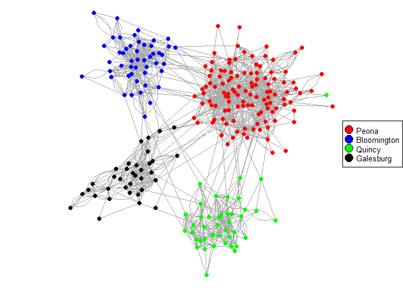

Doctor Network Analysis
================
Cho Ho Lam (Peter)
September 24, 2019

``` r
library(igraph)
library(tidyverse)
library(magrittr)
library(dplyr)
library(RColorBrewer)
library(randomForest)
set.seed(123)
load("doctornet.Rdata")
```

Background
----------

The dataset `doctornet` contains information of a group of doctors from 4 cities: Peoria, Bloomington, Quincy and Galesburg. At the very beginning, some doctors started prescribing a new drug. Through their social network, other doctors heard about the new drug and used it in prescription as well. Our goal here is to understand how the information spread and explain why some doctors adopted the drug sooner/later than the others.

In the data we have various information about individual doctors, including their medical practice and social behavior. There are 4 types of social connection recorded: advice, discussion, friendship, and random.

The work here is based on my final project for the graduate course "Mathematical methods and models for data", taught by Prof. Caroline Colijn in Fall 2018.

The original dataset "Innovation among physicians" was collected by [Coleman, Katz and Menzel](http://moreno.ss.uci.edu/data.html#ckm) in 1966. The dataset we use here was slightly cleaned by Prof. Colijn.

Part 1: Exploratory Data Analysis
---------------------------------

We wish to compute some basic statastics to help us understand the network. As a starter, we calculate how many vertices and edges are there, as well as the mean degree:

``` r
gorder(docnet2) # Number of vertices
```

    ## [1] 242

``` r
gsize(docnet2) # Number of edges
```

    ## [1] 1611

``` r
mean(degree(docnet2)) # Mean degree
```

    ## [1] 13.31405

There are 242 doctors in the network with 1611 connections between them. The mean degree is 13.31405. We do a simple plot of the network and we use different colors to represent which city they came from.

``` r
set.seed(123)
divcols <- c("red", "blue", "green", "black")
vcols <- divcols[V(docnet2)$nodeCity] # Give cities their colors

par(oma = c(0,0,0,0), mar = c(0,0,0,0))
plot(docnet2,vertex.label=NA, vertex.size=3, edge.arrow.size=0.01, vertex.frame.color=NA,xlim=c(-1,1),ylim=c(-1,1), vertex.frame.color="white", vertex.color=vcols)
legend("right", c("Peoria", "Bloomington", "Quincy", "Galesburg"), pch=21, pt.bg=c("red", "blue", "green", "black"),pt.cex=2, cex=.8)
```



Intuitively, the geographical location should be an important factor in cluster analysis since doctors from the same city are more likely to know each other. We will perform a more detailed cluster analysis in the next section.

Fun observation: there is one doctor from Quincy whose only connections are two doctors in Peoria! (The single green dot among the red dots) When we perform cluster analysis using other algorithms, probably this doctor will be grouped with doctors in Peoria.

It is also useful to know that how many doctors are there in each city:

``` r
divcities <- c("Peoria", "Bloomington", "Quincy", "Galesburg")
vcities <- divcities[V(docnet2)$nodeCity]
table(vcities)
```

    ## vcities
    ## Bloomington   Galesburg      Peoria      Quincy 
    ##          48          35         117          42

We can see that about half of the doctors came from Peoria. Only about 15% of them came from Galesburg. To further investiage the vertices, we can look at what attrbiutes are there:

``` r
str(as.data.frame(vertex_attr(docnet2)))
```

    ## 'data.frame':    242 obs. of  14 variables:
    ##  $ name            : Factor w/ 242 levels "1","10","100",..: 1 112 166 177 188 199 210 221 232 2 ...
    ##  $ nodeCity        : int  1 1 1 1 1 1 1 1 1 1 ...
    ##  $ nodeAdoptionDate: int  1 12 8 9 9 10 18 3 11 2 ...
    ##  $ nodeMed_sch_yr  : int  2 6 4 5 4 3 1 4 2 4 ...
    ##  $ nodeMeetings    : int  2 0 1 1 1 0 0 0 2 1 ...
    ##  $ nodeJours       : int  8 4 6 5 3 6 2 8 4 3 ...
    ##  $ nodeFreeTime    : int  1 3 3 1 1 2 1 2 1 2 ...
    ##  $ nodeDiscuss     : int  1 2 1 1 2 2 2 2 1 1 ...
    ##  $ nodeClubs       : int  0 0 0 0 0 0 0 0 0 0 ...
    ##  $ nodeFriends     : int  1 4 3 1 2 1 1 1 1 4 ...
    ##  $ nodeCommunity   : int  6 1 5 4 5 5 6 5 6 5 ...
    ##  $ nodePatients    : int  5 4 4 3 3 5 6 6 1 6 ...
    ##  $ nodeProximity   : int  3 3 2 3 2 3 2 1 2 3 ...
    ##  $ nodeSpecialty   : int  3 1 2 1 1 2 1 1 3 1 ...

We pick a few attrbiutes to take a closer look. For example,

1.  Did they attend any conventions of professional societies recently? (`nodeMeetings`)
2.  What are their specialties? (`nodeSpecialty`)

``` r
ans_meetings <- c("None", "General", "Specialty")
vmeetings <- ifelse(V(docnet2)$nodeMeetings==9, "Unknown", ans_meetings[V(docnet2)$nodeMeetings+1])
table(vmeetings)
```

    ## vmeetings
    ##   General      None Specialty   Unknown 
    ##        65        45       107        25

``` r
ans_specialties <- c("General", "Internist", "Pediatrician", "Other")
vspecialties <- ifelse(V(docnet2)$nodeSpecialty==9, "Unknown", ans_specialties[V(docnet2)$nodeSpecialty])
table(vspecialties)
```

    ## vspecialties
    ##      General    Internist        Other Pediatrician      Unknown 
    ##           66           40          100           18           18

Many doctors (107 to be precise) attended a specialty meeting in the last 12 months; we also obtain some information about the distribution of specialty. Can we tell if they are actually going to the same meeting? Let's check out the specialty distribution for those who went to a specialty meeting.

``` r
table(vspecialties[vmeetings=="Specialty"])
```

    ## 
    ##      General    Internist        Other Pediatrician 
    ##           13           10           70           14

Most pediatricians in the dataset went to a specialty meeting (14 out of 18) - it might suggest that there was a major pediatrician conference in the area. But we cannot be too confident about this since the sample size is really small.

Next, we study the degree distribution.

``` r
length(degree_distribution(docnet2))
```

    ## [1] 58

Therefore the maximum degree is 57.

``` r
degree_distribution(docnet2)
```

    ##  [1] 0.000000000 0.004132231 0.024793388 0.028925620 0.033057851
    ##  [6] 0.033057851 0.016528926 0.049586777 0.061983471 0.066115702
    ## [11] 0.053719008 0.078512397 0.086776860 0.041322314 0.061983471
    ## [16] 0.061983471 0.045454545 0.028925620 0.037190083 0.037190083
    ## [21] 0.033057851 0.004132231 0.012396694 0.004132231 0.020661157
    ## [26] 0.016528926 0.012396694 0.004132231 0.004132231 0.008264463
    ## [31] 0.004132231 0.000000000 0.004132231 0.000000000 0.000000000
    ## [36] 0.004132231 0.000000000 0.004132231 0.000000000 0.000000000
    ## [41] 0.000000000 0.000000000 0.000000000 0.004132231 0.000000000
    ## [46] 0.004132231 0.000000000 0.000000000 0.000000000 0.000000000
    ## [51] 0.000000000 0.000000000 0.000000000 0.000000000 0.000000000
    ## [56] 0.000000000 0.000000000 0.004132231

A histogram for degree distribution:

``` r
hist(degree(docnet2), main="Histogram for degree", xlab="Degree", ylab="Number of vertices", col="grey")
```


We can also look at the top 10 nodes with the highest degree:

``` r
degree(docnet2)[head(order(-degree(docnet2)), n=10L)]
```

    ## 122  29 141  36 212 100  46 189 227 213 
    ##  57  45  43  37  35  32  30  29  29  28

The first row above is the name of the vertices and below is their degrees. It will be interesting to know their positions in the network. We highlighted them with a larger vertex size:

``` r
set.seed(123)
vsize <- ifelse(degree(docnet2)>=28, 6, 3)
par(oma = c(0,0,0,0), mar = c(0,0,0,0))
plot(docnet2,vertex.label=NA, edge.arrow.size=0.01, vertex.frame.color=NA,xlim=c(-1,1),ylim=c(-1,1), vertex.frame.color="white", vertex.color=vcols, vertex.size=vsize)
legend("right", c("Peoria", "Bloomington", "Quincy", "Galesburg"), pch=21, pt.bg=c("red", "blue", "green", "black"),pt.cex=2, cex=.8)
```


Finally, we wish to compute the mean distance of the network. This describes how close are the doctors.

``` r
mean_distance(docnet2)
```

    ## [1] 4.654462

Therefore for any doctor in the network it takes about 4 connections to reach another doctor on average. In Part 3, we will use this to study the centrality of the vertices in the network.

Part 2: Community Detection
---------------------------

First of all, we perform Newman's eigenvector method for community detection.

``` r
Newman <- cluster_leading_eigen(as.undirected(docnet2))
table(vcities, Newman$membership)
```

    ##              
    ## vcities        1  2  3  4  5
    ##   Bloomington  0 48  0  0  0
    ##   Galesburg    0  1  0  0 34
    ##   Peoria      48  1  0 68  0
    ##   Quincy       1  0 40  1  0

The algorithm suggests there should be five communities in our network. The result is very similar to the division using `nodeCity` except the doctors from Peoria are splitted into two small communities. That means in Peoria there might be two major doctor communities, which could be the result of geographical location, medical schools the doctors graduated from, or even genders.

Here is a plot for the 5 clusters.

``` r
set.seed(123)
divcols <- c("red", "blue", "green", "orange", "black")
vcols_Newman <- divcols[Newman$membership]
par(oma=c(0,0,0,0), mar=c(0,0,0,0))
plot(docnet2,vertex.label=NA, vertex.size=3,edge.arrow.size=0.01, vertex.frame.color=NA,xlim=c(-1,1),ylim=c(-1,1), vertex.frame.color="white", vertex.color=vcols_Newman)
legend("right", c("Cluster 1", "Cluster 2", "Cluster 3", "Cluster 4", "Cluster 5"), pch=21, pt.bg=c("red", "blue", "green", "orange", "black"),pt.cex=2, cex=.8)
```


We compare the two community divisions in the following plot. The left one is by Newman's method and the right one is by the `nodeCity` attribute.

``` r
set.seed(123)
par(mfrow=c(1, 2), oma = c(0,0,0,0), mar = c(0,0,0,0))
plot(docnet2,vertex.label=NA, vertex.size=3,edge.arrow.size=0.01, vertex.frame.color=NA,xlim=c(-1,1),ylim=c(-1,1), vertex.frame.color="white", vertex.color=vcols_Newman)

set.seed(123)
plot(docnet2, vertex.label=NA, vertex.size=3,edge.arrow.size=0.01, vertex.frame.color=NA,xlim=c(-1,1),ylim=c(-1,1), vertex.frame.color="white", vertex.color=vcols)
```


Below is a plot for doctors in Peoria only, using Newman's method:

``` r
set.seed(123)
Peoria <- V(docnet2)[V(docnet2)$nodeCity=="1"]
docnet2_Peoria <- induced_subgraph(graph=docnet2, Peoria)
par(oma = c(0,0,0,0), mar = c(0,0,0,0))
plot(docnet2_Peoria,vertex.label=NA, vertex.size=3,edge.arrow.size=0.01, vertex.frame.color=NA,xlim=c(-1,1),ylim=c(-1,1), vertex.frame.color="white", vertex.color=vcols_Newman)
```


Next, we perform cluster analysis using walktrap. We will start with a 10-step walktrap method.

``` r
walktrap1 <- cluster_walktrap(docnet2, steps=10)
table(vcities, walktrap1$membership)
```

    ##              
    ## vcities        1  2  3  4  5  6  7  8  9
    ##   Bloomington 48  0  0  0  0  0  0  0  0
    ##   Galesburg    0 27  8  0  0  0  0  0  0
    ##   Peoria       0  0  0  0 54 58  0  0  5
    ##   Quincy       0  0  0 22  1  0 16  3  0

10-step walktrap suggests there should be 9 communities. Doctors from Bloomington are strongly connected and remain in one community; other cities are usually splited into two major networks. Cluster 8 and 9 are exceptionally small with only 3 and 5 doctors respectively.

We plot the walktrap result below.

``` r
set.seed(123)
divcols <- c("blue", "deeppink", "black", "purple", "orange", "red", "green", "brown", "dodgerblue")
vcols_walktrap1 <- divcols[walktrap1$membership]
par(oma = c(0,0,0,0) , mar = c(0,0,0,0))
plot(docnet2,vertex.label=NA, vertex.size=3,edge.arrow.size=0.01, vertex.frame.color=NA,xlim=c(-1,1),ylim=c(-1,1), vertex.frame.color="white", vertex.color=vcols_walktrap1)
```


By the way, the ways Newman's method and walktrap distribute the Peoria community are a little bit different:

``` r
table(Newman$membership[V(docnet2)$nodeCity==1], walktrap1$membership[V(docnet2)$nodeCity==1])
```

    ##    
    ##      5  6  9
    ##   1  2 45  1
    ##   2  0  1  0
    ##   4 52 12  4

Newman's method put doctors from Peoria into mainly two groups (cluster 1 and 4 on the left) and leaves 1 doctor to the remaining cluster; the 10-step walktrap keeps most doctors in cluster 1 (45 of them) but takes 12 more doctors from cluster 4 to form cluster 6 (on the top) - it also thinks that the doctor left out by Newman's method belongs here too!

What if we try a 15-step walktrap? It turns out that the result is almost identical to the one using `nodeCity`.

``` r
walktrap2 <- cluster_walktrap(docnet2, steps=15)
table(vcities, walktrap2$membership)
```

    ##              
    ## vcities         1   2   3   4
    ##   Bloomington   0   0   0  48
    ##   Galesburg    35   0   0   0
    ##   Peoria        0   0 117   0
    ##   Quincy        0  41   1   0

Of course, the only difference comes from the doctor from Quincy we mentioned earlier - this doctor only connects with doctors from Peoria and hence is grouped with people there. Here is a plot:

``` r
set.seed(123)
divcols <- c("black", "green", "red", "blue")
vcols_walktrap2 <- divcols[walktrap2$membership]
par(oma = c(0,0,0,0), mar = c(0,0,0,0))
plot(docnet2,vertex.label=NA, vertex.size=3,edge.arrow.size=0.01, vertex.frame.color=NA,xlim=c(-1,1),ylim=c(-1,1), vertex.frame.color="white", vertex.color=vcols_walktrap2)
```


To decide which community detection is better, we compute the modularity for all divisions here.

``` r
modularity(as.undirected(docnet2), V(docnet2)$nodeCity)
```

    ## [1] 0.6172169

``` r
modularity(as.undirected(docnet2), Newman$membership)
```

    ## [1] 0.6401503

``` r
modularity(as.undirected(docnet2), walktrap1$membership)
```

    ## [1] 0.6147859

``` r
modularity(as.undirected(docnet2), walktrap2$membership)
```

    ## [1] 0.6184306

Since Newman's method returns the highest modularity, we believe that this is the most suitable community division for the network. For future reference we record the size of each cluster here.

``` r
table(Newman$membership)
```

    ## 
    ##  1  2  3  4  5 
    ## 49 50 40 69 34

Part 3: Centrality Analysis
---------------------------

We wish to determine the top 10% of the doctors that are the most important to the network. That is, if they are absent, it will take significantly more time to transmit information between doctors. There are many measures of importance (centrality) including `degree`, `betweenness` and `closeness`.

1.  If degree is large, that means the vertex is connected to many vertices.
2.  If betweenness is large, that means the vertex occurs a lot in shorest paths.
3.  If closeness is large, that means the vertex can reach other vertices very quickly.

First we look at which doctors are in the top 10% in each measure:

``` r
head(order(-degree(docnet2)), n=24L) # Nodes with highest degree
```

    ##  [1] 122  29 141  36 212 100  46 189 227 213  55  31 145 228  94 180 233
    ## [18] 238   3  11  23  98 174  41

``` r
head(order(-betweenness(docnet2)), n=24L) # Nodes with highest betweenness
```

    ##  [1] 212  30  95 189  79 194 100  54  29 229 135  61  36 173  27 122 232
    ## [18] 192  53 145 220  41  28  90

``` r
head(order(-closeness(as.undirected(docnet2))), n=24L) # Nodes with highest closeness
```

    ##  [1]  95 100  29  36  54  87  98 212  46  93  90  41  30  53 103  28  55
    ## [18]  97  67  11  50  94 162  44

Some vertices appear in all of the three lists, for example 212 and 100. We can also visualize their positions in the network by increasing the size of those vertices.

Nodes with highest degree: they tend to appear in the "center"" of a cluster because they are connected to many people.

``` r
set.seed(123)
vsize <- ifelse(degree(docnet2)>=degree(docnet2)[41], 6, 3)
par(oma = c(0,0,0,0), mar = c(0,0,0,0))
plot(docnet2,vertex.label=NA, edge.arrow.size=0.01, vertex.frame.color=NA,xlim=c(-1,1),ylim=c(-1,1), vertex.frame.color="white", vertex.color=vcols_Newman, vertex.size=vsize)
legend("right", c("Cluster 1", "Cluster 2", "Cluster 3", "Cluster 4", "Cluster 5"), pch=21, pt.bg=c("red", "blue", "green", "orange", "black"),pt.cex=2, cex=.8)
```


Nodes with highest betweenness: they are mostly doctors connecting different clusters - information can easily pass between clusters with their help.

``` r
set.seed(123)
vsize <- ifelse(betweenness(docnet2)>=betweenness(docnet2)[90], 6, 3)
par(oma = c(0,0,0,0), mar = c(0,0,0,0))
plot(docnet2,vertex.label=NA, edge.arrow.size=0.01, vertex.frame.color=NA,xlim=c(-1,1),ylim=c(-1,1), vertex.frame.color="white", vertex.color=vcols_Newman, vertex.size=vsize)
legend("right", c("Cluster 1", "Cluster 2", "Cluster 3", "Cluster 4", "Cluster 5"), pch=21, pt.bg=c("red", "blue", "green", "orange", "black"),pt.cex=2, cex=.8)
```


Nodes with highest closeness: they are mostly doctors in Peoria since there is a lot of doctors and connections between them, and they can reach a large amount of doctors very quickly.

``` r
set.seed(123)
vsize <- ifelse(closeness(as.undirected(docnet2))>=closeness(as.undirected(docnet2))[44], 6, 3)
par(oma = c(0,0,0,0), mar = c(0,0,0,0))
plot(docnet2,vertex.label=NA, edge.arrow.size=0.01, vertex.frame.color=NA,xlim=c(-1,1),ylim=c(-1,1), vertex.frame.color="white", vertex.color=vcols_Newman, vertex.size=vsize)
legend("right", c("Cluster 1", "Cluster 2", "Cluster 3", "Cluster 4", "Cluster 5"), pch=21, pt.bg=c("red", "blue", "green", "orange", "black"),pt.cex=2, cex=.8)
```


Next, we will remove vertices according to degree, betweenness and closeness separately. We will investigate how the `mean_distance` change. If it increases drastically, that means the network is disrupted and now it takes more time to pass some information to the entire network. Recall that the original mean distance was computed in Question 1 and it equals to 4.654462.

``` r
vertices <- c(0, 4, 8, 12, 16, 20, 24)
distance <- c(mean_distance(docnet2), 0, 0, 0, 0, 0, 0)
for (i in 1:6) {
  distance[i+1]=mean_distance(induced_subgraph(graph=docnet2, V(docnet2)[-order(-degree(docnet2))[c(1:(4*i))]]))
}
deg_plot <- as.data.frame(cbind(vertices, distance))

for (i in 1:6) {
  distance[i+1]=mean_distance(induced_subgraph(graph=docnet2, V(docnet2)[-order(-betweenness(docnet2))[c(1:(4*i))]]))
}
bet_plot <- as.data.frame(cbind(vertices, distance))

for (i in 1:6) {
  distance[i+1]=mean_distance(induced_subgraph(graph=docnet2, V(docnet2)[-order(-closeness(as.undirected(docnet2)))[c(1:(4*i))]]))
}
clo_plot <- as.data.frame(cbind(vertices, distance))

removal <- rbind(deg_plot, bet_plot, clo_plot)
removal$Measures <- c(rep("Degree", 7), rep("Betweenness", 7), rep("Closeness", 7))
ggplot(removal, aes(x=vertices, y=distance, group=Measures, col=Measures))+geom_line()
```


Therefore we conclude that remove nodes according to betweenness has the most significant effect. The 24 vertices with the highest betweenness are the most important in information transmission. We can perform some further analysis to study how the network break down without them. For example, what if we employ community detection using Newman's method again?

``` r
important <- head(order(-betweenness(docnet2)), n=24L) # Nodes with highest degree
unimportant <- V(docnet2)[-important]
docnet2_disrupted <- induced_subgraph(graph=docnet2, unimportant)
Newman_disrupted <- cluster_leading_eigen(as.undirected(docnet2_disrupted))
table(Newman$membership[-important], Newman_disrupted$membership)
```

    ##    
    ##      1  2  3  4  5
    ##   1 34  2  1  4  0
    ##   2  0  0 45  1  0
    ##   3  0 36  0  0  0
    ##   4  3  3  1 57  0
    ##   5  0  0  0  0 31

14 doctors (2+1+4+3+3+1) are kicked out of their original group and placed in a new cluster. If we perform walktrap with relatively large number of steps, our results in Question 2 tell us we should basically recover the division using `nodeCity`. However this is not the case after removing these nodes:

``` r
walktrap_disrupted <- cluster_walktrap(docnet2_disrupted, steps=25)
table(vcities[-important], walktrap_disrupted$membership)
```

    ##              
    ##                1  2  3  4  5  6  7
    ##   Bloomington 45  0  0  0  0  0  0
    ##   Galesburg    0  0 23  0  0  0  8
    ##   Peoria       1 30  0  0 73  0  0
    ##   Quincy       0  0  0 34  1  3  0

In other words, the cities are broken into smaller pieces without the "messengers" between them.

Part 4: Information Flow
------------------------

In this section we will study what kinds of nodes tend to get exposed to the new information earlier, and which kinds of nodes get exposed later. We say that a doctor is infected if he/she is exposed to this new information (a new drug in our case). There are two situations we should consider:

1.  The initial infected nodes are known
2.  The initial infected nodes are not known

In (1), we predict that the information will first pass around the communities that the initial nodes belong to, and then slowly to other communities. To illustrate this, we randomly pick 10 doctors in Peoria to start the infection and see how it goes.

In my final year project, a function `plotInfTimeGraph` was provided by Prof. Colijn. Below we will use a modified version of `plotInfTimeGraph`, called `plotInfTimeGraphNew`. It allows us to set the initial colors and it shows infected nodes with white. It also has an argument to control the value of `set.seed`.

``` r
plotInfTimeGraphNew <- function(gr, mytest,mytimes, vcols, i) {
    K=length(mytimes); if (round(K/3)==K/3) {
        par(mfrow=c(K/3, 3), oma = c(5,4,0,0) + 0.1,
          mar = c(0,0,1,1) + 0.1)
    } else {
            if (round(K/2)==K/2) {par(mfrow=c(K/2,2), oma = c(5,4,0,0) + 0.1,
          mar = c(0,0,1,1) + 0.1)}
    }
    for (n in 1:length(mytimes)) {
        thistime=mytimes[n]
        whosinfected=which(mytest$results$infected[mytest$results$t==thistime])
        vsizes=rep(3,length(V(gr)))
        vcols[whosinfected]="white" # Infected becomes white
        set.seed(i) # Set seed to keep the same configuration
        plot(gr,vertex.color=vcols,vertex.size=vsizes, vertex.frame.color=NA, vertex.label=NA, edge.arrow.size=0.1, xlim=c(-1,1), ylim=c(-1,1))
    }
}
```

``` r
P_sample <- sample(V(docnet2)[nodeCity==1], 10) # Pick 10 doctors from Peoria

mytest <- simEpi(docnet2, init_infected = P_sample, inf.prob = 0.5, max.time = 3000)
par(oma=c(0,0,0,0), mar=c(0,0,0,0))
plotInfTimeGraphNew(docnet2,mytest,c(1), vcols_Newman, 123)
```


``` r
plotInfTimeGraphNew(docnet2,mytest,c(100), vcols_Newman, 123)
```


``` r
plotInfTimeGraphNew(docnet2,mytest,c(500), vcols_Newman, 123)
```


``` r
plotInfTimeGraphNew(docnet2,mytest,c(1000), vcols_Newman, 123)
```


``` r
plotInfTimeGraphNew(docnet2,mytest,c(1500), vcols_Newman, 123)
```


At time 1500, almost everyone in Peoria is infected but the other cities/clusters are barely affected. We can also start with Bloomington:

``` r
B_sample <- sample(V(docnet2)[nodeCity==2], 10) # Pick 10 doctors from Bloomington

mytest <- simEpi(docnet2, init_infected = B_sample, inf.prob = 0.5, max.time = 3000)
par(oma=c(0,0,0,0), mar=c(0,0,0,0))
plotInfTimeGraphNew(docnet2,mytest,c(1), vcols_Newman, 123)
```


``` r
plotInfTimeGraphNew(docnet2,mytest,c(100), vcols_Newman, 123)
```


``` r
plotInfTimeGraphNew(docnet2,mytest,c(500), vcols_Newman, 123)
```


``` r
plotInfTimeGraphNew(docnet2,mytest,c(1000), vcols_Newman, 123)
```


``` r
plotInfTimeGraphNew(docnet2,mytest,c(1500), vcols_Newman, 123)
```


This confirms that information passes around first within a community.

Then we will consider (2): that is, the initial nodes are completely random and we have no information about their positions. Is there a particular cluster that is more easily affected by the new information? Or are there some vertcices that are always infected in an early stage?

We perform 20 trials by choosing approximately 10% of nodes in each cluster to be infected, and we find the first 10% of the doctors that are usually infected first.

``` r
set.seed(123)
infection <- integer(242)
for (i in 1:20) {
  sample1 <- sample(V(docnet2)[Newman$membership==1], 5)
  sample2 <- sample(V(docnet2)[Newman$membership==2], 5)
  sample3 <- sample(V(docnet2)[Newman$membership==3], 4)
  sample4 <- sample(V(docnet2)[Newman$membership==4], 7)
  sample5 <- sample(V(docnet2)[Newman$membership==5], 3)
  A_sample <- union(union(union(union(sample1, sample2), sample3), sample4), sample5)
  mytest <- simEpi(docnet2, init_infected = A_sample, inf.prob = 0.5, max.time = 2000)$timeToInfection
  mytest_time <- mytest$time.infected
  for (j in 1:242) {
    if (mytest_time[c(j)]=="Inf") {
      mytest_time[c(j)]=2500 # If never infected, set infection time to 2500
    }
  }
  for (j in 1:242) {
    infection[c(j)] <- infection[c(j)]+mytest_time[c(j)]
  }
}
head(order(infection), n=24L) # Top 10%
```

    ##  [1]  29  36 141 126  31 122  46  20 140 189 212 125 144 101   5 233 228
    ## [18] 100 145   3 214  37  23  54

We recognize some vertices we saw before: e.g. 212 and 100. We believe that these vertices are usually infected first since they are "central" in the network. Therefore we compare the ranking using infection time witht the ones using degree, betweenness, or closeness and see how similiar are they.

``` r
nodes <- c(1:242)
similarity <- integer(242)
for (i in 1:242) {
  common <- intersect(head(order(infection), n=i), head(order(-degree(docnet2)), n=i)) # Infection time versus degree
  similarity[i] <- length(common)
}
deg_plot=as.data.frame(cbind(nodes, similarity))

for (i in 1:242) {
  common <- intersect(head(order(infection), n=i), head(order(-betweenness(docnet2)), n=i)) # Infection time versus betweenness
  similarity[i] <- length(common)
}
bet_plot <- as.data.frame(cbind(nodes, similarity))

for (i in 1:242) {
  common <- intersect(head(order(infection), n=i), head(order(-closeness(as.undirected(docnet2))), n=i)) # Infection time versus closeness
  similarity[i] <- length(common)
}
clo_plot <- as.data.frame(cbind(nodes, similarity))

for (i in 1:242) {
  similarity[i] <- nodes[i] # Infection time versus infection time (which is identical)
}
opt_plot <- as.data.frame(cbind(nodes, similarity))

compare1 <- rbind(deg_plot, bet_plot, clo_plot, opt_plot)
compare1$Measures <- c(rep("Degree", 242), rep("Betweenness", 242), rep("Closenss", 242), rep("Optimal", 242))
ggplot(compare1, aes(x=nodes, y=similarity, group=Measures, col=Measures))+geom_line()
```


The degree curve performs consistently better than the ones for betweenness and closeness. That means if we rank the vertices using infection time and degree, the two rankings are more similar than using infectction time and betweenness, or using infection time and closeness.

We also investigate the infection rate of each cluster on average.

``` r
nodes <- c(1:242)
proportion <- integer(242)
for (i in 1:242) {
  common <- intersect(head(order(infection), n=i), V(docnet2)[Newman$membership==1]) # Doctors in Cluster 1
  proportion[i]=length(common)/49 # Proportion
}
plot_c1=as.data.frame(cbind(nodes, proportion))

for (i in 1:242) {
  common <- intersect(head(order(infection), n=i), V(docnet2)[Newman$membership==2]) # Doctors in Cluster 2
  proportion[i]=length(common)/50 # Proportion
}
plot_c2=as.data.frame(cbind(nodes, proportion))

for (i in 1:242) {
  common <- intersect(head(order(infection), n=i), V(docnet2)[Newman$membership==3]) # Doctors in Cluster 3
  proportion[i]=length(common)/40 # Proportion
}
plot_c3=as.data.frame(cbind(nodes, proportion))

for (i in 1:242) {
  common <- intersect(head(order(infection), n=i), V(docnet2)[Newman$membership==4]) # Doctors in Cluster 4
  proportion[i]=length(common)/69 # Proportion
}
plot_c4=as.data.frame(cbind(nodes, proportion))

for (i in 1:242) {
  common <- intersect(head(order(infection), n=i), V(docnet2)[Newman$membership==5]) # Doctors in Cluster 5
  proportion[i]=length(common)/34 # Proportion
}
plot_c5=as.data.frame(cbind(nodes, proportion))

compare2 <- rbind(plot_c1, plot_c2, plot_c3, plot_c4, plot_c5)
compare2$Clusters <- c(rep("Cluster 1", 242), rep("Cluster 2", 242), rep("Cluster 3", 242), rep("Cluster 4", 242), rep("Cluster 5", 242))
ggplot(compare2, aes(x=nodes, y=proportion, group=Clusters, col=Clusters))+geom_line()
```


The difference in infection rates of the clusters are insignificant. As long as there is a similar proportion of infected node within a cluster, the information will spread in a similar rate.

We summarize all our observation as follows:

1.  The infection starts within communities.
2.  Higher the degree, easier to be exposed.
3.  The difference between clusters are insignificant if they are equally exposed at the beginning.

It is possible to improve our understanding of the network by considering the vertex attributes. But we will leave this for next time.

Thank you for your interest in my work! If you have any comments or questions, please let me know!
